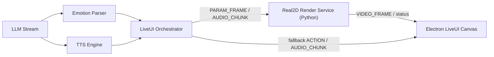

# SPEC2: 基于 LivePortrait 的实时虚拟形象驱动系统

本文档作为 Infiniti Agent 第二期开发重点，目标是在现有 LiveUI、TTS、表情标签和 WebSocket 能力之上，引入 LivePortrait/FasterLivePortrait 类“参数化渲染后端”，把当前的 Live2D/PNG 表情切换升级为可由情感、语音和动作指令共同驱动的 2D 实时虚拟形象。

## 1. 结论与建议

建议二期不要直接替换现有 LiveUI，而是新增一个可选的 `real2d` 渲染链路：

- 保留现有 Live2D/PNG 作为稳定 fallback。
- 在父目录新增独立 Python service repo，负责 LivePortrait/FasterLivePortrait 推理、关键点融合和视频帧输出。
- Node/Electron 侧只负责 LLM 标签解析、TTS 音频流、状态调度和前端播放，不把 CUDA/TensorRT 逻辑塞进主包。
- 第一阶段优先跑通“单图 + 手动参数 + 本地预览”，第二阶段再接语音口型，第三阶段再做实时流与 TensorRT 优化。

这样做的原因是：当前项目已经具备 LiveUI WebSocket、TTS 音频流、ASR、情感标签解析和 Canvas 渲染基础。二期最大风险在 GPU 推理、口型质量和端到端延迟，不应让这些风险破坏现有可用体验。

## 2. 现有基础

当前项目已经具备以下能力：

- `infiniti-agent live` 启动 WebSocket + Electron LiveUI。
- 前端使用 HTML5 Canvas/Pixi 渲染 Live2D 或 PNG 精灵表情。
- `src/liveui/emotionParse.ts` 已支持 `[Happy]`、`[Sad]`、`[Nod]` 等流式标签解析。
- `src/liveui/wsSession.ts` 已支持 `ACTION`、`AUDIO_CHUNK`、`AUDIO_RESET`、`SYNC_PARAM` 等消息。
- TTS 已支持 MiniMax、MOSS-TTS-Nano、VoxCPM2，且前端已有 PCM 播放和基于音频 RMS 的简易口型估计。
- `generate_avatar` 已能生成半身像和多表情 PNG，可作为 LivePortrait source image 的前置资产来源。

因此二期应复用“文本/标签/TTS/WS/UI”链路，只新增“真实 2D 参数化渲染服务”和协议适配层。

## 3. 二期目标

### 3.1 产品目标

让用户在 LiveUI 中看到一个由单张 AI 原画驱动的实时 2D 形象，具备：

- 根据 LLM 输出情感标签切换表情。
- 根据 TTS 音频驱动嘴型。
- 自动眨眼、轻微呼吸、微头动。
- 支持 `nod`、`wave`、`surprised` 等动作/状态指令的扩展。
- 在性能不足或渲染后端不可用时，自动回退到现有 Live2D/PNG 表情模式。

### 3.2 工程目标

- 新增 `real2d` 后端服务，不侵入主 CLI 的核心对话逻辑。
- 定义 Node 与 Python 后端之间的稳定协议。
- 定义 emotion/action 到参数向量的映射格式。
- 跑通可测量的端到端 demo：输入一句文本，TTS 播放，同时虚拟形象完成表情 + 口型 + 帧渲染。

## 4. 推荐架构



推荐模块划分：

- Node 主进程：继续负责 LLM、TTS、ASR、会话、配置、WebSocket。
- `infiniti-real2d-service`：父目录独立 repo，加载 LivePortrait/FasterLivePortrait 权重，维护 source image cache，执行关键点融合和帧渲染。
- `infiniti-agent/src/real2d/*`：只保留 Real2D client、协议类型、健康检查、消息桥接，不放 Python/CUDA/TensorRT 推理代码。
- Electron 前端：新增一种 avatar renderer mode，支持接收视频帧或 MJPEG/WebRTC 流，渲染到 Canvas/Video。

## 4.1 仓库拆分策略

第二期开始，项目应明确区分“Agent 编排层”和“重模型服务层”：

```text
/Users/stelee/Dev/infiniti-agent/
├── infiniti-agent/          # Node/Electron 主仓：CLI、TUI、LiveUI、会话、ASR、服务 client
├── infiniti-llm-service/    # Ollama/vLLM 启动、健康检查、OpenAI-compatible profile
├── infiniti-tts-service/    # VoxCPM/MOSS-TTS-Nano 等本地 TTS 服务
└── infiniti-real2d-service/ # LivePortrait/FasterLivePortrait/MuseTalk/Wav2Lip 渲染服务
```

拆分原则：

- 依赖 Python/CUDA/TensorRT/PyTorch 的能力放独立 service repo。
- 需要下载大模型权重的能力放独立 service repo。
- 需要长驻进程、健康检查、单独性能优化的能力放独立 service repo。
- 与 LiveUI 麦克风、VAD、打断强耦合且当前为 Node 依赖的 ASR，暂时保留在 `infiniti-agent` 主仓。
- 主仓只保存 service client、配置类型、协议类型和 fallback 编排。

## 5. 核心设计

### 5.1 情感解析与参数映射

保留现有 `[Happy]` 风格标签作为第一优先级，不建议二期马上改成 XML。原因是当前流式解析已经工作，且对 TUI 展示和持久化清理都有配套逻辑。

新增 `real2dEmotionMap`，将情感映射为参数向量：

```json
{
  "neutral": {
    "smile": 0,
    "eyeOpen": 1,
    "brow": 0,
    "pitch": 0,
    "yaw": 0,
    "roll": 0
  },
  "happy": {
    "smile": 0.8,
    "eyeOpen": 0.92,
    "brow": 0.2,
    "pitch": 5,
    "yaw": 0,
    "roll": 0
  },
  "sad": {
    "smile": -0.4,
    "eyeOpen": 0.7,
    "brow": -0.3,
    "pitch": -10,
    "yaw": 0,
    "roll": 0
  }
}
```

参数融合公式：

```text
P_final = P_base + alpha * E_emotion + beta * L_lip + gamma * N_idle + delta * A_action
```

默认建议：

- `alpha = 1.0`：情感权重。
- `beta = 1.0`：口型权重。
- `gamma = 0.08`：呼吸、微头动、随机眨眼。
- `delta = 1.0`：点头、惊讶等动作权重。
- 表情切换使用 160-240ms lerp，避免瞬间变脸。

### 5.2 语音口型

建议分两档实现：

第一档：复用当前前端 RMS mouth estimator，把 TTS PCM 的音量转成 `mouthOpen` 参数。这一档质量普通，但改动小，适合验证 LivePortrait 参数驱动链路。

第二档：接入 MuseTalk 或 Wav2Lip-Light，将音频转为嘴部关键点序列。推荐把它放在 Python 服务内，而不是 Node 内：

- Python 更适合加载 PyTorch/CUDA 模型。
- 可与 LivePortrait 推理共享 GPU 进程。
- 可以减少跨进程传输中间 mouth landmark 的复杂度。

优先级建议：

1. 先做 RMS -> mouthOpen -> LivePortrait mouth params。
2. 再做离线音频 -> 口型视频。
3. 最后做流式音频 -> 实时口型。

### 5.3 渲染后端

推荐优先使用 FasterLivePortrait 作为实验入口，因为二期重点是低延迟和服务化，而不是从原版脚本大改。

Python 服务职责：

- 加载 source image。
- 预热模型。
- 提取并缓存 feature map / base keypoints。
- 接收 emotion/lip/action 参数。
- 输出视频帧。
- 提供健康检查和性能指标。

建议 API：

```text
GET  /health
POST /session/start
POST /session/params
POST /session/audio
POST /session/stop
GET  /metrics
```

帧输出方式优先级：

1. Phase 1 使用本地文件或 MJPEG，便于调试。
2. Phase 2 使用 WebSocket binary frame，便于与现有 LiveUI 集成。
3. Phase 3 再评估 WebRTC，适合真正低延迟音视频同步。

### 5.4 前端渲染

LiveUI 新增三种 renderer mode：

- `live2d`：现有 Live2D。
- `sprite`：现有 PNG 表情。
- `real2d`：新增 LivePortrait/FasterLivePortrait 渲染。

`real2d` 模式下，前端应支持：

- 接收 JPEG/PNG/WebP binary frame 并绘制到 Canvas。
- 或接收后端提供的 MJPEG/WebRTC URL 并挂到 `<video>`。
- 保留聊天输入、麦克风、TTS 开关、气泡等现有 UI。
- 后端不可用时自动 fallback 到 `spriteExpressions` 或 `live2dModel3Json`。

## 6. 配置草案

建议在 `config.json` 的 `liveUi` 下新增：

```json
{
  "liveUi": {
    "renderer": "real2d",
    "real2d": {
      "enabled": true,
      "baseUrl": "http://127.0.0.1:8921",
      "sourceImage": "./live2d-models/jess/real2d/source.png",
      "emotionMap": "./live2d-models/jess/real2d/emotions.json",
      "fps": 25,
      "frameFormat": "jpeg",
      "fallbackRenderer": "sprite",
      "autoStartService": false,
      "mouthDriver": "rms"
    }
  }
}
```

字段建议：

- `renderer`：`live2d | sprite | real2d`。
- `real2d.baseUrl`：Python 渲染服务地址。
- `real2d.sourceImage`：单张原画。
- `real2d.emotionMap`：情感参数字典。
- `real2d.fps`：目标帧率，先用 20-25，优化后再到 30。
- `real2d.frameFormat`：`jpeg | webp | raw`，先用 `jpeg`。
- `real2d.fallbackRenderer`：后端失败时回退模式。
- `real2d.mouthDriver`：`rms | musetalk | wav2lip`。

## 7. 协议草案

Node -> Python：

```json
{
  "type": "PARAM_UPDATE",
  "sessionId": "live-001",
  "timestampMs": 123456,
  "emotion": "happy",
  "params": {
    "smile": 0.8,
    "eyeOpen": 0.9,
    "mouthOpen": 0.3,
    "pitch": 5,
    "yaw": 0,
    "roll": 0
  },
  "transitionMs": 200
}
```

```json
{
  "type": "AUDIO_CHUNK",
  "sessionId": "live-001",
  "format": "pcm_s16le",
  "sampleRate": 24000,
  "channels": 1,
  "audioBase64": "..."
}
```

Python -> Node/UI：

```json
{
  "type": "REAL2D_STATUS",
  "ready": true,
  "fps": 24.8,
  "latencyMs": 42,
  "backend": "faster-liveportrait"
}
```

```json
{
  "type": "REAL2D_FRAME",
  "sessionId": "live-001",
  "timestampMs": 123489,
  "format": "jpeg",
  "frameBase64": "..."
}
```

二期早期可以让 Python 直接推给前端，也可以让 Node 做桥接。推荐 Node 桥接，因为它能统一 fallback、日志和 session 生命周期。

## 8. 开发里程碑

### Phase 0: 技术验证

目标：证明本机可以跑通 FasterLivePortrait/LivePortrait 参数控制。

交付物：

- `scripts/setup-real2d-venv.sh`
- `scripts/start-real2d-renderer.sh`
- `tools/real2d-smoke-test.py`
- 一张 source image 输入后，可通过参数改变微笑、眨眼、抬头。

验收标准：

- 能在本地输出 3-5 秒测试视频或帧序列。
- 手动修改参数能产生可见变化。
- 记录平均单帧耗时和硬件环境。

### Phase 1: 服务化和协议

目标：把渲染能力封装成 Python HTTP/WebSocket 服务。

交付物：

- Python `real2d` 服务。
- `/health`、`/session/start`、`/session/params`、`/metrics`。
- Node 侧 `Real2dClient`。
- 配置解析与健康检查。

验收标准：

- `infiniti-agent live` 启动后能检测 real2d 服务可用性。
- 服务不可用时不影响现有 LiveUI。
- 参数更新延迟可观察、可记录。

### Phase 2: 情感驱动

目标：LLM 标签驱动 LivePortrait 表情变化。

交付物：

- `emotionMap` JSON 格式。
- `[Happy]`、`[Sad]`、`[Angry]`、`[Surprised]`、`[Thinking]`、`[Neutral]` 映射到 real2d params。
- 160-240ms 表情插值。
- 自动眨眼与 idle motion。

验收标准：

- 流式回复开头出现 `[Happy]` 等标签时，画面在 200ms 左右平滑切换。
- 空闲 3-5 秒随机眨眼。
- 长时间对话不出现明显卡死或状态漂移。

### Phase 3: 语音口型

目标：TTS 音频驱动嘴型。

交付物：

- 第一版 RMS mouth driver。
- 可选 MuseTalk/Wav2Lip-Light 离线口型实验。
- 音频播放时间线与帧时间线对齐策略。

验收标准：

- 播放 TTS 时嘴部随音量开合。
- 语音结束后嘴部自然闭合。
- 重置/打断时音频和口型同时停止。

### Phase 4: 实时流优化

目标：进入可长期使用的实时体验。

交付物：

- WebSocket binary frame 或 WebRTC 传输。
- TensorRT/ONNX/Torch compile 优化评估。
- 帧率、延迟、显存、CPU 指标面板。
- source image 规范和背景建议。

验收标准：

- 目标 20-25 FPS 起步，优化目标 30 FPS。
- 交互场景端到端视觉延迟控制在 150ms 以内。
- 单帧推理优化目标小于 20ms，但不作为早期阻塞项。

## 9. 技术风险与缓解

### 9.1 GPU 和平台风险

LivePortrait/FasterLivePortrait 通常更依赖 NVIDIA CUDA。当前项目是 Node/Electron 主包，不能假设所有用户都有 CUDA。

缓解：

- real2d 默认可选，不作为 `infiniti-agent live` 必需依赖。
- 配置中明确 `fallbackRenderer`。
- README 中区分 macOS/CPU 调试模式与 CUDA 实时模式。

### 9.2 口型质量风险

RMS mouthOpen 易出现“音量开合”，不像真实发音口型。MuseTalk/Wav2Lip 更真实，但延迟和集成复杂度高。

缓解：

- 先用 RMS 做实时 demo。
- 把高质量口型作为 Phase 3/4 目标。
- 允许不同 mouth driver 插拔。

### 9.3 背景拉伸

LivePortrait 在头部大幅运动时可能拉扯背景。

缓解：

- source image 使用纯色、简单渐变或已透明背景。
- 限制 `yaw/pitch/roll` 范围。
- 尝试 stitching 模式或前景分割后贴回静态背景。

### 9.4 音画同步

TTS 当前是流式 PCM 播放，渲染后端如果单独处理音频，容易和前端播放时间线错位。

缓解：

- 早期以“前端播放时间”为主，Node 同步发送 mouthOpen/params。
- 后期如由 Python 处理音频口型，需要把 frame timestamp 和 audio playhead 明确纳入协议。

### 9.5 打包和依赖体积

LivePortrait 权重、PyTorch、TensorRT 不适合塞进 npm 包。

缓解：

- Python real2d 服务作为可选外部组件。
- 提供 setup 脚本和配置模板，不默认随 npm 发布权重。
- `npm run build` 不依赖 Python 环境。

## 10. 推荐第二期开发重点

二期主线建议按以下顺序推进：

1. 建立 `real2d` 可选配置和 fallback 机制。
2. 跑通 FasterLivePortrait 参数控制 smoke test。
3. 封装 Python 渲染服务和 Node `Real2dClient`。
4. 将现有 `[Emotion]` 标签映射到 real2d 参数。
5. 接入 RMS mouth driver，实现 TTS 时嘴部开合。
6. 前端新增 `real2d` renderer mode，接收并绘制帧。
7. 加入性能指标、健康检查和故障回退。
8. 再评估 MuseTalk/Wav2Lip-Light 与 TensorRT 优化。

不建议二期一开始就投入：

- 完整 WebRTC 音视频栈。
- 高质量口型模型的实时流式推理。
- 多角色、多摄像机、多动作库。
- 将 CUDA/PyTorch 依赖并入 npm 安装流程。

这些工作应放在 Phase 4 或第三期，否则会把核心验证周期拖长。

## 11. 最小可行 Demo 定义

最小可行 Demo 应满足：

- 配置 `liveUi.renderer = "real2d"`。
- 启动 `infiniti-agent live` 后，如果 real2d 服务可用，前端显示 source image 驱动的视频帧。
- 输入或模型输出 `[Happy]你好呀`，形象平滑微笑。
- TTS 播放时嘴部随音频开合。
- 点击停止/打断时音频、嘴型、表情状态同步复位。
- real2d 服务关闭后，LiveUI 自动回退到现有 sprite 或 Live2D，不影响聊天和 TTS。

## 12. 第一批代码落点

建议优先新增或修改：

在 `infiniti-real2d-service`：

- `scripts/setup-real2d-venv.sh`：安装 Python 环境。
- `scripts/start-real2d-renderer.sh`：启动渲染服务。
- `real2d_service/app.py`：FastAPI/WebSocket 服务入口。
- `real2d_service/protocol.py`：服务侧协议类型。
- `tools/real2d-smoke-test.py`：离线参数验证。

在 `infiniti-agent`：

- `src/config/types.ts`：增加 `liveUi.renderer` 和 `liveUi.real2d` 配置类型。
- `src/config/io.ts`：解析 real2d 配置。
- `src/real2d/client.ts`：Node 到 Python 服务客户端。
- `src/real2d/protocol.ts`：协议类型定义。
- `src/liveui/wsSession.ts`：桥接 real2d status/frame/param。
- `liveui/src/main.ts`：新增 `real2d` renderer mode。

这一批落点完成后，再决定是否引入 MuseTalk/Wav2Lip-Light。
